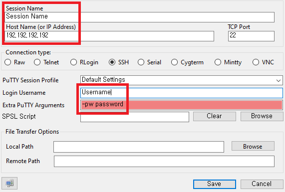
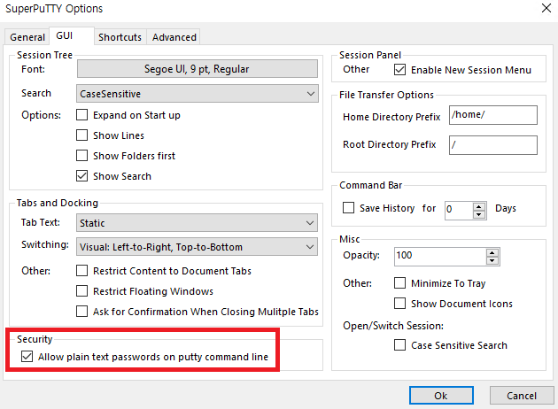

### sshfs 

```bash
# window server
# Launch PowerShell as an administrator
Start-Service sshd

# check
Get-Service sshd
```

<br/>

### run client

#### 1. Using SuperPuTTY





<br/>

#### 2. SSHFS to Mount Remote File Systems Over SSH

```bash
sudo apt update
sudo apt install python3-pip

# mount
sshfs Tor@X.X.X.X:D:\\\Tor_CIFS_300 /home/jjangga94temp/Tor_CIFS -o allow_other,umask=000,reconnect,nonempty

# check
df -hT
```

<br/>

<br/>

### Pcap_collector

- **server_GUI-PyQt**

- ##### from_server_to_client

  In an operating system, there are many programs, which may be either run by an user or by the OS itself (such as system services). Such programs which are running on the system are called “processes”.

  The number `9` is the signal number for the **SIGKILL** signal

  - ##### pkill_all-tor.py

    ````bash
    ---------------------------SSH START---------------------------
    Count:  18
    Target IP:  X.X.X.X
    USER Info.:  root , PW:  XXXXXX
    Now Command:  ps -ecf | grep tor/tor
    root      4743  4686 TS   19 10:56 ?        00:00:00 bash -c ps -ecf | grep tor/tor
    root      4746  4743 TS   19 10:56 ?        00:00:00 grep tor/tor
    root      9588     1 TS   19  8월11 ?      00:12:25 /home/tor/tor-browser_en-US/Browser/TorBrowser/Tor/tor -f -
    
    root      4757  4686 TS   19 10:56 ?        00:00:00 bash -c ps -ecf | grep tor/tor
    root      4759  4757 TS   19 10:56 ?        00:00:00 grep tor/tor
    
    ---------------------------SSH END---------------------------
    ````

  - ##### pkill_all-sshfs.py

    ```bash
    ---------------------------SSH START---------------------------
    Count:  17
    Target IP:  X.X.X.X
    USER Info.:  root , PW:  XXXXXX
    jjangga+ 20972     1 TS   19 09:52 ?        00:00:00 sshfs Tor@X.X.X.X:D:\Tor_CIFS_300 /home/jjanggaXXXX/Tor_CIFS -o allow_other,umask=000,reconnect,nonempty
    root     23104 23031 TS   19 11:31 ?        00:00:00 bash -c ps -ecf | grep sshfs
    root     23107 23104 TS   19 11:31 ?        00:00:00 grep sshfs
    
    root     23118 23031 TS   19 11:31 ?        00:00:00 bash -c ps -ecf | grep sshfs
    root     23120 23118 TS   19 11:31 ?        00:00:00 grep sshfs
    
    ---------------------------SSH END---------------------------
    ```

